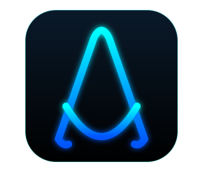
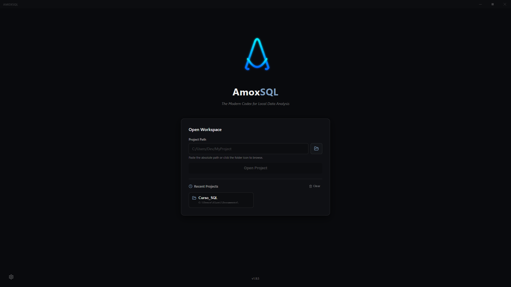
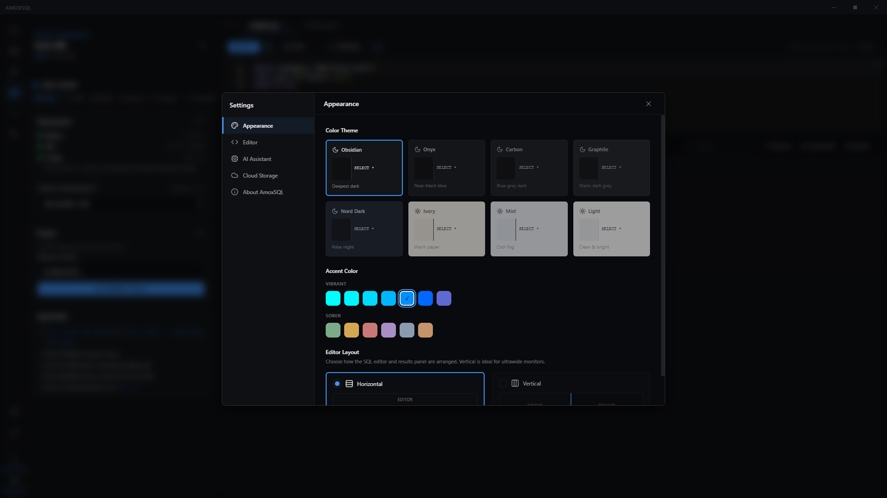
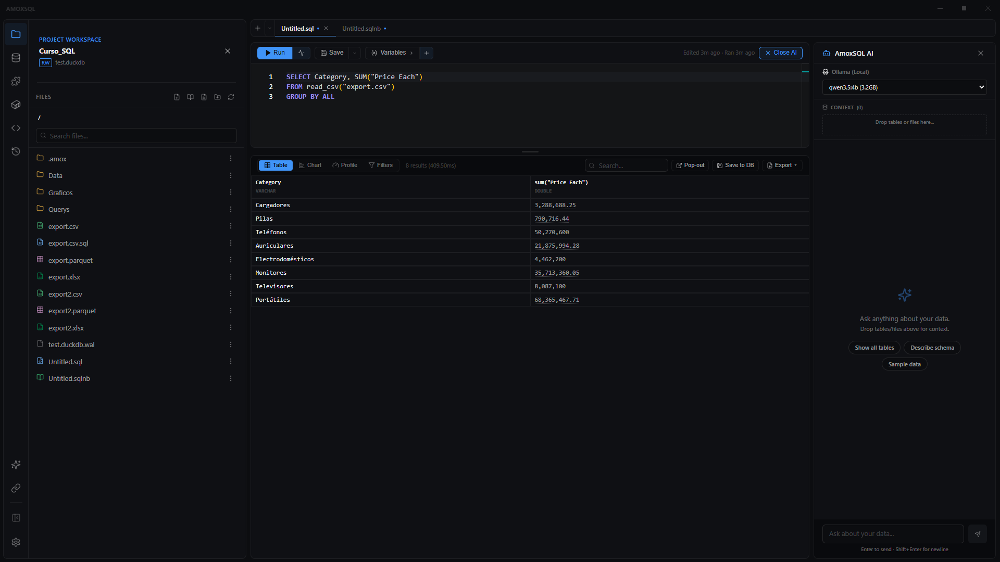
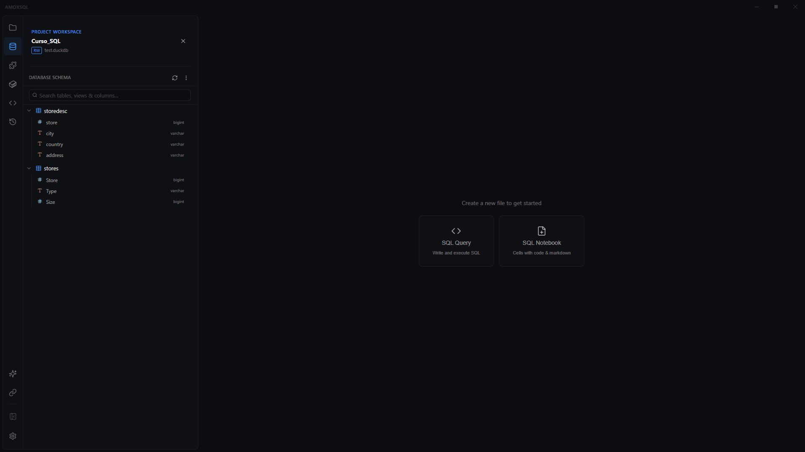
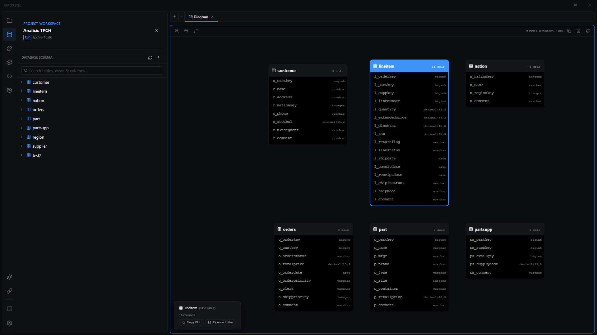
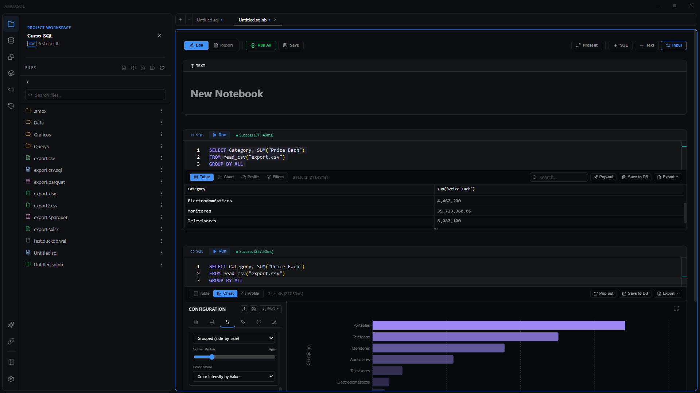
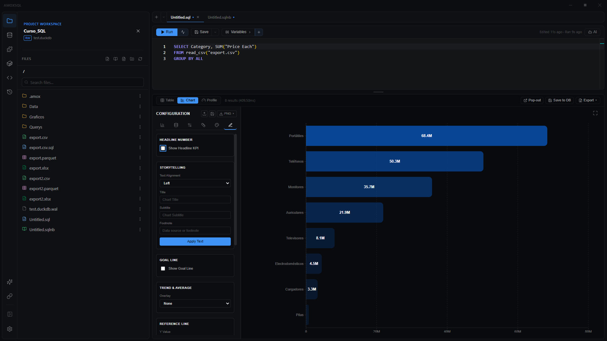
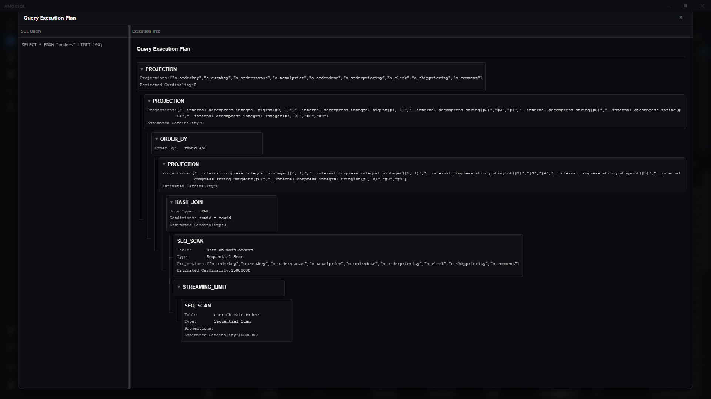
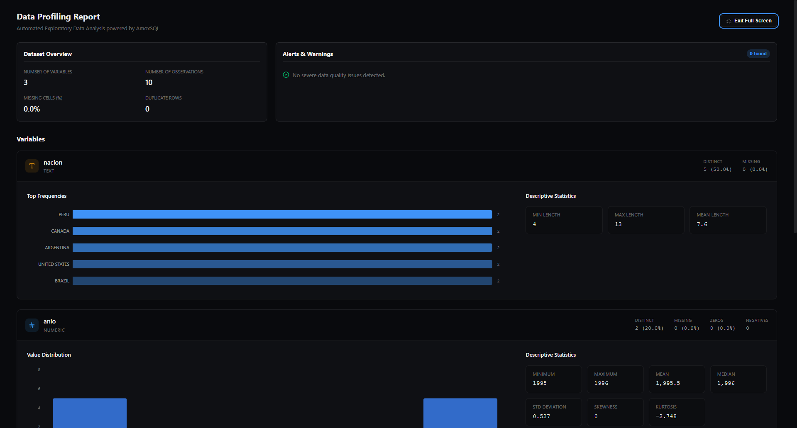

 

# AmoxSQL (v3.8.0)

> **El Códice Moderno para el Análisis Local de Datos.**
>
> *Un IDE de alto rendimiento, local-first, construido desde Latinoamérica para la comunidad global de desarrolladores.*

**AmoxSQL** es un IDE de datos local profesional y de alto rendimiento construido específicamente para [DuckDB](https://duckdb.org/). Diseñado para analistas de datos e ingenieros que necesitan velocidad, privacidad y herramientas avanzadas sin la sobrecarga del cloud.

---

## 📜 La Historia Detrás del Nombre

Los datos son la forma moderna del conocimiento registrado. La identidad de nuestro proyecto está enraizada en este concepto atemporal de la antigua Mesoamérica.

El nombre **"Amox"** deriva de la palabra náhuatl ***Amoxtli***, que significa "libro" o "códice". Estos repositorios sagrados eran usados por los escribas para registrar historia, cálculos astronómicos y conocimiento.

**AmoxSQL** es el sucesor espiritual de aquellas herramientas antiguas — un códice digital moderno diseñado para la era de los datos.

### El Emblema

El glifo luminoso que representa a AmoxSQL simboliza la fusión de estructura antigua y energía moderna.

* **La Estructura:** La 'A' estilizada evoca la precisión arquitectónica de un glifo antiguo o un esquema de datos estructurado.
* **La Luz:** El resplandor cian eléctrico corta a través del entorno oscuro del IDE, representando la promesa central de la herramienta: **transformar datos crudos y opacos en visualizaciones luminosas y claras.**

---

## 🚀 Características Principales

AmoxSQL está diseñado para velocidad, privacidad y una experiencia de desarrollador superior.

### ✨ Lo Nuevo (v3.0 → v3.3)

Mucho ha pasado desde el último release. Lo más reciente:

* **🔬 v3.3 — Plan de Ejecución real + Profiling con storytelling**
    * **Plan de ejecución real**: toggle **Estimado / Real** — el modo *Real* corre `EXPLAIN ANALYZE` y muestra **tiempo y filas reales por operador**, con nombres amigables, el paso más lento resaltado, desglose por fases (Planning · Execution · I/O), vistas **Cost** y **Graph (DAG)**, **pistas de optimización** en lenguaje natural y un botón **"Optimize with AI"**.
    * **Profiling rediseñado (storytelling)**: un **veredicto** en lenguaje natural, scorecard, **hallazgos rankeados** con el porqué y una acción sugerida, overview de columnas con tipos semánticos + detalle on-demand, **Plot** (abre un gráfico nuevo editable con su propia query), **narración con IA** y **exportación HTML/PDF**. Detección más rica: outliers reales, email por valores, rango/huecos de fechas y claves candidatas compuestas.
* **⚡ v3.2 — Rendimiento e Inteligencia del Editor**
    * **Interfaz instantánea**: cambio de panel/pestaña sin saltos, scroll fluido incluso con un gráfico a pantalla completa detrás (se eliminaron todos los efectos de desenfoque que costaban compositing) y panel de IA que abre sin tirones.
    * **Autocompletado más rápido y mejor rankeado**: las sugerencias se filtran y re-ordenan en el momento; las columnas y alias en contexto rankean por encima de keywords, recuerda tu última elección por prefijo, y prioriza columnas ya usadas en la sentencia (p. ej. una columna del `SELECT` repetida en `GROUP BY`).
    * **Detección de cláusula robusta** incluso en queries sobre archivos (`FROM 'data.csv'`).
    * **Columnas reales de CTEs y subqueries**: el editor resuelve, vía el propio motor DuckDB, las columnas de salida de un `WITH`/subquery — incluidas derivadas como `SELECT a + b AS total`.
* **🧱 v3.1 — Data Flow**: el constructor visual de canalizaciones (DAG) gana nodos nuevos (Date/Time, Flatten/Unnest, Cloud Bucket S3/GCS, Google Sheet, **AI Enrich** por fila), una paleta reorganizada en 9 grupos por intención y documentación integrada por nodo.
* **🔬 v3.0 — Deep Dive**: rediseño completo del análisis agéntico en una ventana de 3 regiones (chat · inspector por paso · Plan + Artefactos), más la capa **"Ask about this"** para referenciar cualquier gráfico, query, paso o hallazgo y conversar sobre él (`@`/`#`, quick-actions, selección flotante).

> Historial completo en [CHANGELOG.md](./CHANGELOG.md).

### 🎨 Sistema de Diseño Linear UI
* **10 Temas de Color:** **Amox Dark**, Obsidian, Onyx, **Ayu Dark**, Nord Dark, Dark Islands (oscuros) + **Amox Light**, Ivory, Mist, Light (claros). Amox Dark/Light son los temas insignia de marca (cyan/teal) y Ayu Dark es una adaptación fiel de la paleta de [ayu-colors](https://github.com/ayu-theme/ayu-colors). El editor de código Monaco sigue el tema y el acento en vivo, y todos los temas están calibrados a los mismos pisos de contraste WCAG.
* **13 Colores de Acento:** 7 vibrantes (Cyan, Aqua, Sky, Azure, Blue, Cobalt, Linear Blue) + 6 sobrios (Sage, Amber, Rose, Lavender, Steel, Copper).
* **Layout Flexible:** Horizontal (default) o Vertical para monitores ultrawide.
* **Card-Based Layout:** Interfaz flotante con bordes sutiles y superficies elevadas.

### 🧠 Arquitectura Central y Flujo de Trabajo
* **Flujo Centrado en Proyectos**: Organiza tu trabajo en carpetas de proyecto. El IDE auto-detecta archivos `.duckdb` o `.db` al abrir un proyecto.
* **Arquitectura Multi-Tab**: Trabaja en múltiples queries y notebooks simultáneamente.
* **Split View**: Compara código lado a lado o visualiza resultados junto a tu editor.
* **Gestión Robusta de Conexiones**: Estrategia de "Hard Reset" para cambios limpios entre proyectos.
* **Resultados Emergentes (Popout)**: Desprende resultados a ventanas independientes para ambientes multi-monitor.

### 🤖 AmoxSQL AI (Inteligencia Agéntica Local y Cloud)

*   **Sistema Agéntico con Tool-Calling**: El asistente de IA ejecuta herramientas autónomamente (SQL, listar tablas, describir esquemas, generar gráficos, sugerir pasos siguientes).
*   **Nueva Arquitectura de Paneles**: Separación clara entre *AI Assistant* (contexto de archivo activo) y *Deep Dive* (exploración agéntica a pantalla completa de toda la BD).
*   **Gestión de Contexto Avanzada**: Compactación automática de mensajes, recorte astuto de resultados de herramientas para prevenir sobrecarga de tokens (AI SDK v6 support).
*   **100% Offline y Privado (Local)**: Potenciado por **Ollama** (Qwen 2.5, Llama 3.2, Gemma 2). Tus datos nunca salen de tu máquina.
*   **Cloud Power**: Cambia sin fricciones a proveedores cloud — **Google Gemini, Anthropic, OpenAI y Google Vertex** — con tracking de uso.
*   **Gestión Integrada de Modelos**: Descarga nuevos modelos de Ollama directamente desde el IDE con progreso en tiempo real.
*   **Conversaciones Persistentes**: Historial de chat guardado entre sesiones, incluso sin proyecto conectado.
*   **Lenguaje Natural a SQL**: Haz preguntas como *"Muéstrame los 5 mejores productos por ventas en 2023"* y obtén SQL DuckDB preciso.

#### 🔬 Deep Dive — Análisis Agéntico Profundo (rediseñado en v3.0)
*   **Ventana de 3 regiones**: chat (izquierda) · inspector por paso del plan, con SQL legible + tabla de resultados + gráficos inline + razonamiento (centro) · barra fija de Plan + Artefactos (derecha). La síntesis final se renderiza como tarjeta narrativa en el chat.
*   **"Ask about this"**: referencia cualquier gráfico, query, paso del plan o hallazgo y conversa sobre él — con autocompletado `@`/`#`, quick-actions (Explain · Redo differently · Go deeper · Validate) y selección de texto/número flotante.
*   **Agentic Loop adaptativo**: presupuesto de iteraciones según la complejidad del plan; botón **"Continue"** si se agota a mitad; el plan persiste entre turnos y retoma desde el último paso, sin re-ejecutar el EDA completo en follow-ups.
*   **Notebooks bajo demanda** (`build_notebook`, con modo *update* incremental) y persistencia de conversaciones desde el primer mensaje.
*   **Watchdog anti-cuelgue**: un stream de modelo congelado se aborta tras 90s de silencio y el plan continúa, en vez de quedarse colgado.

### 💾 Gestión e Inspección de Base de Datos

*   **Modos de Conexión Flexibles**: In-Memory, Read-Only, o Read/Write.
*   **Inspector de Tablas tipo Data Warehouse**: Schema, Data Profile, Preview (200 rows paginadas), DDL.
*   **Diagramas ER Interactivos**: Visualización SVG automática de tablas y relaciones con drag, zoom, y generación de DDL.

*   **Drag & Drop Intuitivo**: Arrastra tablas o columnas del sidebar directamente al editor SQL.
*   **Tabla de Resultados Mejorada**: Búsqueda global, ordenamiento por columnas, tipos de datos nativos, redimensionamiento libre.
*   **Guardar en Base de Datos**: Materializa resultados como `TABLE` o `VIEW` directamente.

### 🏗️ DBT Studio e Ingeniería de Datos

*   **Integración dbt completa**: Desarrolla con **dbt + DuckDB** nativamente.
*   **Detección de Entorno**: Detecta automáticamente Python, dbt, Conda y Mamba.
*   **Auto-Generadores**: Editores visuales para modelos dbt, sources (`schema.yml`), y perfiles (`profiles.yml`).
*   **Grafo de Linaje (Data Lineage)**: Visualización DAG interactiva de dependencias entre modelos dbt.
*   **Constructor de Comandos**: Ejecuta `dbt run`, `dbt test`, `dbt compile` con salida en terminal en tiempo real.
*   **Data Flow — Constructor Visual de Canalizaciones (DAG)**: Construye pipelines ETL locales y workflows de datos arrastrando y soltando nodos (React Flow); los documentos son cadenas (`.sqlchain`).
    *   **Biblioteca de nodos ampliada (v3.1)**: ejecución SQL, Notebooks, DDL tables, validaciones de calidad, visualizaciones, Transform y Export — más los nuevos **Date/Time**, **Flatten/Unnest**, **Cloud Bucket** (S3/GCS), **Google Sheet** y **AI Enrich** (aplica el modelo de IA por fila: clasifica, extrae, resume, redacta PII).
    *   **Paleta organizada en 9 grupos por intención** + documentación integrada por nodo (popover "?" y pestaña **Info** en la configuración), con guía in-app *"What is Data Flow?"* y tour de primer uso.
    *   **Propagación de contexto entre nodos**: la salida de un nodo alimenta a sus dependientes (e.g. una validación de calidad sobre subconsultas de nodos SQL previos), con inspector y previsualización instantánea de SQL/resultados por nodo.

### 📝 Edición SQL y Notebooks

* **Editor SQL Potente**: Powered by **Monaco Editor** y Tree-sitter, con análisis del SQL en un worker (detección de cláusula, scope de alias, *smart dotting*).
* **Autocompletado Inteligente (v3.2)**: sugerencias rápidas y bien rankeadas — columnas/alias en contexto por encima de keywords, memoria de selección por prefijo, y prioridad a lo ya usado en la sentencia. Además resuelve las **columnas reales de CTEs y subqueries** consultando al propio motor DuckDB, incluidas derivadas como `SELECT a + b AS total`.
* **Autocompletado de Archivos Contextual**: Escaneo inteligente de estructura para predecir autocompletado restringido al ámbito de los archivos (`.csv`, `.parquet`, `.json`, `.xlsx`) referenciados EXCLUSIVAMENTE en las cláusulas `FROM/JOIN` de la declaración evaluada en el cursor.
* **SQL Notebooks (`.sqlnb`)**: Experiencia tipo Jupyter para SQL con celdas Markdown y SQL en diseño *card-based floating*.

* **🚀 NUEVO: Editor de Markdown Data-Aware (`.md`)**: Potente herramienta dedicada a escritores y analistas que desean generar documentación enriquecida.
    * **Soporte Mermaid:** Crea diagramas ER y flujos de datos iterativos que se renderizan automáticamente y se adaptan a tu tema claro u oscuro.
    * **Autocompletado Estilo Notion (`@`)**: Al teclear `@`, el editor te sugerirá instantáneamente tablas/columnas de tu BD o enlaces a archivos de tu proyecto (`.sql`, `.amoxvis`).
    * **Smart Hover Cards:** Pasa el mouse sobre enlaces a scripts o gráficos para previsualizar el código SQL o la configuración del gráfico en miniaturas flotantes.
    * **Exportación PDF One-Click**: Exporta todo el documento enriquecido como un reporte PDF con un solo clic.
* **Modo Presentación**: Oculta código y muestra solo Markdown, gráficos y tablas.
* **Exportación PDF**: Exporta notebooks como reportes PDF profesionales.
* **Snippets y Variables**: Fragmentos DuckDB integrados e interpolación de parámetros (`${variable_name}`).
* **Historial de Consultas**: Timeline persistente de queries ejecutadas con bookmarks.
* **File Explorer Nutado**: El panel de archivos incorpora renderizado de tamaño en bytes (e.g. `24 KB`), agrupación ordenada flexible, utilidades context-menu anti-desborde responsivas y opciones para extraer metadatos estructurados (nombres de columnas/hojas) directamente al editor.
* **Personalización Premium**: 6 familias tipográficas, minimapa, word wrap, números de línea, tamaño de fuente ajustable.

### 📊 Story Flow — Visualización de Datos

* **Story Flow**: la sección de visualización organizada en un flujo de 6 etapas (**Type → Data → Format → Style → Story → Export**), con guía in-app y tour de primer uso.
* **15+ Tipos de Gráfico** (Recharts): Line, Bar (H/V), Scatter, Donut, Area, **Combo (Bar+Line)**, **Funnel**, **Heatmap**, **Treemap** y más.
* **Capa de Storytelling**: anotaciones, *takeaway*, énfasis y narrativa — para **contar** la historia de los datos, no solo graficarlos.
* **Configuraciones Persistentes (`.amoxvis`)**: Guarda diseños de visualización como archivos en tu workspace.
* **Controles Avanzados**: Pivot & Agregación, escalas logarítmicas, líneas/áreas de referencia, headlines KPI.
* **Formato Numérico**: Compact (1.2K), Millions (1.2M), Currency, Porcentaje.
* **Exportación de Alta Calidad**: PNG hasta 4x de escala; reportes HTML/PDF autocontenidos.

### 🐛 Herramientas Avanzadas de Depuración y Profiling
*   **CTE Debugger**: Step-through interactivo para Common Table Expressions.
*   **Plan de Ejecución (real)**: Toggle **Estimado / Real** — el modo *Real* corre `EXPLAIN ANALYZE` (tiempo y filas reales por operador). Árbol legible con nombres amigables, paso más lento resaltado, desglose por fases (Planning · Execution · I/O), vistas **Cost** y **Graph (DAG)**, **pistas de optimización** en lenguaje natural y **"Optimize with AI"**.

*   **Data Profile (storytelling)**: Reporte EDA que **comunica** — un veredicto en lenguaje natural, scorecard, **hallazgos rankeados** (con el porqué + acción sugerida), overview de columnas con tipos semánticos y detalle on-demand, **Plot** a un gráfico nuevo editable, **narración con IA** y export **HTML/PDF**. Detecta outliers reales, emails por valor, rango/huecos de fechas y claves candidatas compuestas.

*   **Importación/Exportación Multi-formato**: CSV, Parquet, JSON, Excel (XLSX).
*   **Cloud Storage**: Exportación directa a AWS S3 y Google Cloud Storage.

---

## 🛠️ Tech Stack

* **Frontend**: [React](https://reactjs.org/), [Vite](https://vitejs.dev/), [Monaco Editor](https://microsoft.github.io/monaco-editor/), [Recharts](https://recharts.org/).
* **Backend**: [Node.js](https://nodejs.org/), [Express](https://expressjs.com/).
* **Database Engine**: [DuckDB](https://duckdb.org/) (via high-performance Node.js bindings).
* **AI**: [Ollama](https://ollama.ai/) (local) + cloud — Google Gemini, Anthropic, OpenAI y Google Vertex — vía [Vercel AI SDK](https://sdk.vercel.ai/) + Zod.

---

## ⬇️ Instalación y Descarga

### 🎉 v3.8.0 — Deep Dive reimaginado: narra, cierra bien y grafica con criterio

Este software está disponible **libre y abierto** a toda la comunidad.
Descarga el instalador pre-construido para Windows directamente desde GitHub Releases:

👉 **[Descargar AmoxSQL v3.8.0](https://github.com/dsandovalflavio/amoxsql/releases/latest)**

> **Nota:** Los releases beta iniciales incluyen el instalador pre-construido gratis.
> En adelante, los instaladores continuos pre-construidos estarán disponibles exclusivamente para [GitHub Sponsors](https://github.com/sponsors/dsandovalflavio).

### 🛠️ Compilar desde Código Fuente (Siempre Gratis)

1. Clona el repositorio.
2. Asegúrate de tener **Node.js 20+**, **pnpm 11+** y herramientas de compilación C++ instaladas (para los bindings nativos de DuckDB).
3. Ejecuta `pnpm install` en la raíz y de nuevo dentro de `client/`.
4. Ejecuta `pnpm start` en la raíz.

> *Las versiones auto-compiladas no incluyen auto-updates ni binarios firmados.*

---

## ❤️ Sponsor & Support

AmoxSQL es construido y mantenido por un desarrollador solo desde Latinoamérica.
Si encuentras esta herramienta útil, considera patrocinar el proyecto para mantenerlo vivo y en crecimiento.

**Los Sponsors obtienen:**
- 🔓 Acceso a un **repositorio privado** con instaladores pre-construidos
- ⚡ **Acceso anticipado** a nuevas características
- 🗳️ **Prioridad** para feature requests y bug fixes
- 💬 Canal de comunicación directo con el desarrollador

👉 **[Conviértete en Sponsor en GitHub](https://github.com/sponsors/dsandovalflavio)**

---

## 🖥️ Guía de Uso

### Empezando
1.  **Welcome Screen**: Al iniciar, ingresa la **Ruta Absoluta** de tu carpeta de proyecto.
2.  **Selección de Base de Datos**: Si se detectan archivos `.db`, un modal te pedirá seleccionar uno para adjuntar (Read-Only/Read-Write) o iniciar una sesión en memoria.

### Operaciones Core
* **Ejecutar SQL**: En un archivo `.sql` o celda de notebook, escribe tu query y presiona `Ctrl/Cmd + Enter`.
* **Importar Datos**: Clic derecho sobre un archivo (CSV, Parquet) o carpeta en el File Explorer y selecciona "Import to DB".
* **Visualizar Resultados**: Después de ejecutar una query, cambia la pestaña del panel inferior de "Results" a "Chart".
* **Crear Notebook**: Clic derecho en el File Explorer y selecciona "New Notebook" para crear un archivo `.sqlnb`.
* **Abrir ER Diagram**: Navega al panel lateral y selecciona la vista de Diagrama ER.
* **Usar DBT Studio**: Abre el panel DBT Studio desde la barra lateral para gestionar tu proyecto dbt.

---

## ⚖️ Licencia

Este proyecto es source-available bajo la **AmoxSQL Community License**.

Puedes ver, modificar y compilar el código fuente para uso personal o educativo.
**La redistribución comercial y el uso SaaS están estrictamente prohibidos.**

Ver el archivo [LICENSE](./LICENSE) para los términos completos.

### ®️ Aviso de Marca Registrada
El nombre "AmoxSQL" y el logo de AmoxSQL son marcas registradas de Flavio Sandoval.

---

## ❤️ Agradecimientos y Créditos

* **[DuckDB](https://duckdb.org/)**: Por crear el increíble motor de base de datos SQL OLAP in-process.
* **[Monaco Editor](https://microsoft.github.io/monaco-editor/)**: Por proporcionar una experiencia de edición de clase mundial.
* **[Recharts](https://recharts.org/)**: Por su librería de gráficos componible y confiable.
* **[React](https://reactjs.org/) & [Vite](https://vitejs.dev/)**: Por la experiencia de desarrollo frontend rápida y moderna.
* **[Node.js](https://nodejs.org/) & [Express](https://expressjs.com/)**: Por la base robusta del backend.
* **[react-markdown](https://github.com/remarkjs/react-markdown)**: Por habilitar las capacidades de texto enriquecido en SQL Notebooks.

---

## 🤝 Contribuir

¡Damos la bienvenida a contribuciones de todos! AmoxSQL es un proyecto impulsado por la comunidad.

Ya sea reportando bugs, sugiriendo features, o enviando pull requests, tu ayuda es apreciada.

> **Nota:** Al contribuir a AmoxSQL, aceptas que tus contribuciones serán licenciadas bajo la [AmoxSQL Community License](./LICENSE).

---

  <a href="https://dsandovalflavio.github.io/amoxsql-landing-page/">🌐 Official Website</a> · 
  <a href="https://github.com/sponsors/dsandovalflavio">💖 Sponsor</a> · 
  <a href="https://github.com/dsandovalflavio">👤 @dsandovalflavio</a>
    
  Creado con 💙 desde Latinoamérica para el Mundo.

