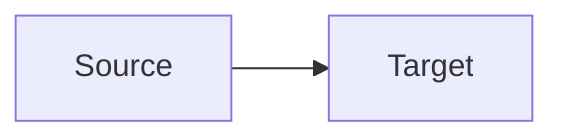

# AmoxDiagram

**🌐 English · [Español](../../es/editor/amoxdiagram.md)**

> Draw architectures and processes by dragging boxes. What gets saved is mermaid text: an `.amoxdiagram` file, or the diagram that already lives inside one of your documents.

<!-- 📷 CAPTURE: docs/images/editor/amoxdiagram.png — AmoxDiagram with an architecture diagram: shape palette and outline on the left, canvas with two grouped zones and boxes coloured by layer in the centre, inspector on the right, and the mermaid panel open at the bottom. -->

## What it is

**AmoxDiagram** is the visual diagram editor. You draw with the mouse and **what gets saved
is mermaid**, the same text your documents already understood — a block like:

````

````

Two consequences follow, and you notice both straight away. First, **the diagram reads
without the application**: in a repository's file browser, in any text editor, anywhere
markdown is displayed. Second, **version control understands it**: a diff says "a box was
added", not "the binary file changed".

A diagram can live two ways:

- As **its own file**, `.amoxdiagram`. A diagram that exists in its own right.
- As a **block inside a document**. A diagram that explains something, with its text
  around it.

## When to use it

- To draw the **architecture** of a data platform: sources, landing zones, transformation
  layers, warehouses, consumers.
- To document an **intended process** before building it — an experiment flow, a
  retraining loop.
- To explain **where a number comes from** to someone who is not going to read the SQL.

## How to use it

### Getting started

A new diagram comes from the `+` in the tab bar, the file explorer, the command palette, or
the first screen of a freshly opened project. All four create an `.amoxdiagram` with three
example boxes.

If the diagram already lives inside a document, hover over the drawing in **Read** view and
press **Editar**. It opens in its own tab.

### Drawing

There are three ways to add a box, for three different moments:

| Gesture | When |
|---|---|
| Click a shape in the palette | You already know which shape you want |
| Double-click empty canvas | The first time |
| <kbd>Tab</kbd> with a box selected | You have the diagram in your head and you're pouring it out |

With a box selected, all three **chain** the new one to it. To write the text, double-click
on the box. To connect two boxes, drag from the edge of one to the other.

### The seven shapes

Each one means something, and the inspector names them by meaning:

| Shape | What it usually is |
|---|---|
| Process | A step: a transformation, a job |
| Soft step | A minor step, or the beginning and the end |
| Store | A database, a file, a bucket |
| Decision | A fork: does it pass quality? |
| Input | Something arriving from outside |
| Output | Something leaving: a report, a file |
| Milestone | A reference point: the dashboard, the deliverable |

### Arrows say how it runs

Three styles, named for what they mean rather than for their syntax:

- **Batch** — the plain line. What runs every day, every hour.
- **Continuous** — the dashed line. Event by event.
- **Main path** — the thick line. What you want looked at first.

### Zones and layers

These are the two things that turn a pile of boxes into an architecture.

A **zone** groups boxes into a frame: landing, refined, consumption. Select several boxes
with <kbd>Ctrl</kbd> and press **Agrupar**. Ungrouping removes the frame; the boxes stay
where they were.

A **layer** is a colour: which boxes are sources, which are processing, which are outputs.
You assign it from the inspector. A box carries one layer, not several — two colours
overlap and the result depends on the order of lines in the file.

### Saving

If the diagram is an `.amoxdiagram`, it saves to its own file. If it came from a document,
**the button says so**: *Guardar en architecture.md*. Only that block is rewritten; the
rest of the document is untouched.

If somebody changed the document while you were editing, you are warned before anything is
written, and there are three ways out: cancel, save the diagram separately as its own file,
or overwrite.

### Taking it with you

**SVG** for a document that will be printed or zoomed; **PNG** to paste into a
presentation. Both are asked of mermaid, so the image is **the same one the document
draws**, not a screenshot of the editor.

## What it doesn't do, and why

**Boxes are not positioned by hand.** Mermaid does not store coordinates: if you could pin
them, you would place a box, save, and find it somewhere else on reopening. In exchange the
drawing never comes out crooked, and what you see in the editor is exactly what the
document will show.

**There are no product icons.** Write whatever you like in the label; the name of a system
is your content.

**Not every diagram opens.** Only flowcharts. A sequence or state diagram still works in
your documents, it simply doesn't offer the edit button — that isn't a failure, it's a
different kind of diagram. And if a flowchart uses something the editor can't draw yet, it
tells you **which line**.

**What it doesn't understand, it doesn't touch.** Your `classDef`, `style`, `click`,
`%%{init}%%` directives and comments survive any edit word for word.

## Related

- [Data Flow](../data-flow/data-flow.md) — generate a diagram skeleton from a chain
