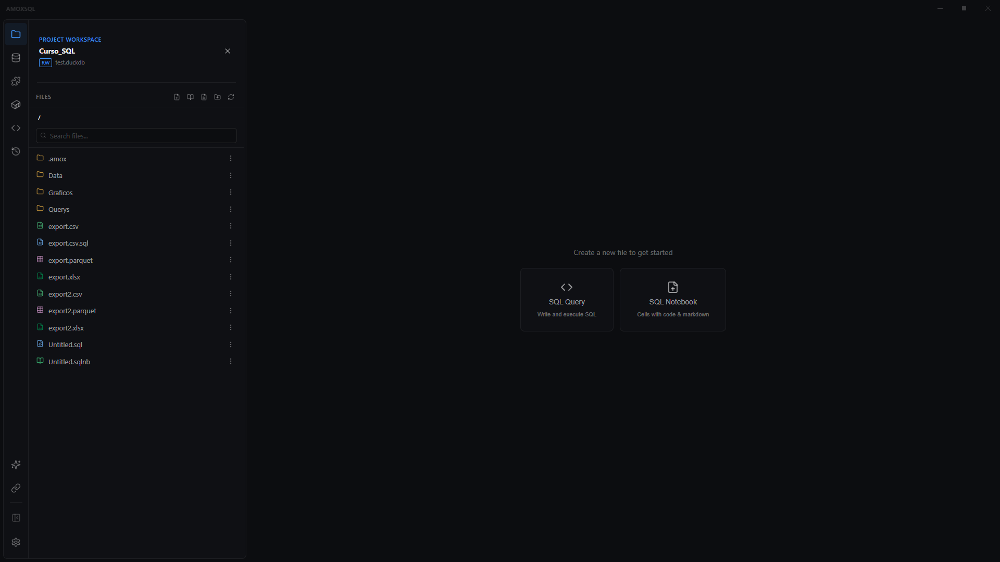

# The interface

**🌐 English · [Español](../../es/user-guide/interface.md)**

> A tour of AmoxSQL's areas: the activity bar, the side panel, the editor area with tabs and split panes, and the command palette.

## Main areas

### Title bar (top)
Shows the **active workspace** (name · connection mode MEM/RO/RW · database) and window controls. The workspace widget expands to show recent projects and the option to close the workspace.

<!-- 📷 CAPTURE: docs/images/user-guide/title-bar-workspace.png — title bar with the workspace widget expanded -->

### Activity bar (far left)
Icons that swap the side panel's content:

<!-- 📷 CAPTURE: docs/images/user-guide/activity-bar.png — the activity bar with its icons highlighted -->

| Icon | Panel |
|---|---|
| Explorer | Project [file explorer](../data/file-explorer.md) |
| Database Schema | [Database explorer](../data/database-explorer.md) (schemas, tables, ER) |
| Extensions | [DuckDB extensions](../data/duckdb-extensions.md) |
| DBT Studio | [DBT integration](../dbt/dbt-studio.md) |
| Snippets | [SQL snippets](../editor/snippets.md) |
| Query History | [History & bookmarks](../editor/history-and-bookmarks.md) |
| Analysis Vault | [Saved analyses](../ai/analysis-vault.md) |
| Source Control | Project Git status |
| Deep Dive | [Deep agentic analysis](../ai/deep-dive.md) |

At the bottom: **Chart Gallery**, **New Execution Chain** ([Data Flow](../data-flow/data-flow.md)), collapse sidebar, and **Settings**.

### Editor area (center)
This is where **tabs** live. Each tab is a file (`.sql`, `.sqlnb`, `.sqlchain`, `.md`, `.amoxdeck`, `.amoxvis`) or a special view (Deep Dive, ER diagram, DBT lineage). You can:

- **Split into two panes** and drag tabs between them (see [Layout, tabs & panes](../editor/layout-tabs-and-panes.md)).
- Edit SQL with results below (see [SQL editor](../editor/sql-editor.md)).

<!-- 📷 CAPTURE: docs/images/user-guide/split-view.png — split view with two panes -->

### Results panel (below the editor)
Appears when you run a query. Toggle between **Table**, **Chart**, and **Profile**. See [Results table](../results/results-table.md).

## Command palette

**Ctrl+Shift+P** opens the palette: search and run any action (run query, save, switch theme, open panels, zoom, tours…). It's the fastest way to reach any feature without remembering where it lives. See [Command palette](../editor/command-palette.md).

<!-- 📷 CAPTURE: docs/images/user-guide/command-palette.png — command palette open -->

## Appearance

The theme (light/dark, 10 themes), accent color, typography, and zoom are set in **Settings → Appearance**. See [Themes & appearance](themes-and-appearance.md).

## Related
- [First steps](first-steps.md) · [Projects & connections](projects-and-connections.md)
- [Layout, tabs & panes](../editor/layout-tabs-and-panes.md) · [Command palette](../editor/command-palette.md)
- [Keyboard shortcuts](../reference/keyboard-shortcuts.md)
