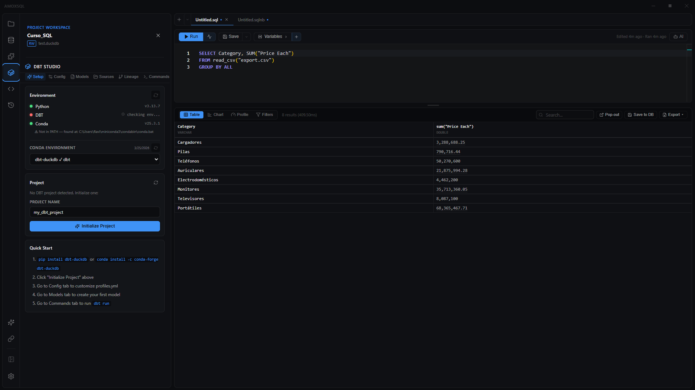

# DBT Studio

**🌐 [English](../../en/dbt/dbt-studio.md) · Español**

> El panel de AmoxSQL para trabajar con proyectos dbt sobre DuckDB: detecta tu entorno, edita la configuración, genera modelos y fuentes, construye y ejecuta comandos, y visualiza el linaje — sin salir de la app.

## Qué es

**DBT Studio** es un panel integrado para gestionar un proyecto dbt que corre sobre DuckDB. En lugar de saltar a una terminal, obtienes una interfaz con seis secciones — Setup, Config, Models, Sources, Commands y Lineage — que cubren el ciclo de trabajo: preparar el entorno, configurar los perfiles, crear modelos y fuentes, ejecutar comandos y ver cómo se conectan tus modelos.

AmoxSQL no incluye dbt: lo detecta en tu sistema (Python + dbt, opcionalmente vía Conda/Mamba) y ejecuta la línea de comandos de dbt por ti, transmitiendo la salida en vivo. El código y los archivos del proyecto (`profiles.yml`, `dbt_project.yml`, tus modelos `.sql` y los YAML de fuentes) viven en tu proyecto como siempre.

Cambias de sección con las pestañas de la parte superior del panel. La sección **Lineage** también puede abrirse en su propia pestaña a pantalla completa.

## Cuándo usarlo

- Cuando tu análisis usa **dbt para transformar** datos en DuckDB y quieres gestionarlo desde AmoxSQL.
- Para **arrancar un proyecto dbt** rápido: detectar el entorno, inicializar el proyecto y configurar el perfil de DuckDB.
- Para **generar el andamiaje** de modelos (staging, intermediate, mart, incremental) y de fuentes sin escribir el YAML a mano.
- Para **ejecutar comandos de dbt** (`run`, `build`, `test`…) con un constructor visual y ver el resultado con su código de salida.
- Para **entender las dependencias** entre modelos con el grafo de linaje.

Si solo quieres ejecutar SQL directo sobre DuckDB, usa el [Editor SQL](../editor/sql-editor.md); DBT Studio es para proyectos que usan dbt.

## Cómo usarlo

### 1. Setup (preparar el entorno)
1. En la tarjeta **Environment**, pulsa refrescar para detectar **Python**, **dbt**, **Conda** y **Mamba**; cada uno muestra un punto verde/rojo y su versión.
2. Si usas Conda, elige un **entorno** en el selector; DBT Studio marca los que tienen dbt instalado y comprueba su versión exacta.
3. En la tarjeta **Project**, refresca para detectar un proyecto dbt existente. Si no hay ninguno, escribe un nombre y pulsa **Initialize Project** para crear uno.

### 2. Config (configurar el proyecto)
1. Edita `profiles.yml` con campos de formulario: nombre del perfil, target, hilos, ruta del archivo DuckDB y esquema. Pulsa **Save Profile** para escribirlo.
2. La tarjeta de `dbt_project.yml` muestra un resumen (nombre, versión, perfil, rutas de modelos).

### 3. Models (generar modelos)
1. Elige una **plantilla**: staging, intermediate, mart, incremental o basic. La ruta y la materialización por defecto se ajustan solas a la plantilla.
2. Escribe el nombre del modelo y, si quieres, ajusta ruta, materialización, esquema y descripción.
3. Pulsa **Create Model**; el archivo se crea y se abre en el editor.

### 4. Sources (definir fuentes)
1. Escribe el nombre de la fuente y, opcionalmente, el esquema.
2. Añade una o más **tablas** (nombre + descripción). Usa **Add Table** para más filas.
3. Pulsa **Create Source**; se genera el YAML de la fuente y se muestra una vista previa que puedes copiar.

### 5. Commands (ejecutar dbt)
1. Usa las **acciones rápidas** (Run All, Compile, Test, Debug) o el **constructor de comandos**.
2. En el constructor, elige la acción (`run`, `build`, `compile`, `test`, `seed`, `snapshot`, `debug`, `clean`, `deps`, `parse`) y añade banderas: `--select`, `--exclude`, `--target` y, para run/build, `--full-refresh`.
3. El comando final se muestra abajo (con `conda run -n <env>` delante si hay un entorno seleccionado). **Copia** al portapapeles o pulsa **Execute**.
4. La salida se transmite en vivo en el panel **Output**, con una insignia de **código de salida** al terminar (verde si es 0, rojo si no).

### 6. Lineage (linaje)
1. Abre la sección **Lineage** (o el botón **Open in tab** para verla a pantalla completa).
2. El grafo se construye desde el `manifest.json` del proyecto; si no existe, ejecuta `dbt compile` primero.
3. Los nodos están **coloreados por tipo** (source, seed, model, snapshot…), con insignias de tipo y materialización. Pasa el cursor para resaltar las conexiones y ver los detalles; **haz clic** en un nodo para abrir su archivo.
4. Usa los controles de **zoom** y arrastra para hacer paneo; **Reset View** vuelve al encuadre inicial.

## Referencia de secciones

| Sección | Qué hace |
|---|---|
| **Setup** | Detecta Python/dbt/Conda/Mamba, selecciona el entorno Conda, detecta o inicializa el proyecto |
| **Config** | Edita `profiles.yml` (perfil de DuckDB) y muestra un resumen de `dbt_project.yml` |
| **Models** | Generador de modelos: staging, intermediate, mart, incremental, basic |
| **Sources** | Generador de definiciones de fuentes (YAML) con una o más tablas |
| **Commands** | Constructor de comandos dbt con banderas, ejecución transmitida e insignia de código de salida |
| **Lineage** | Grafo (DAG) desde `manifest.json`, coloreado por tipo; clic para abrir el archivo |

### Acciones de comandos disponibles
| Acción | Uso típico |
|---|---|
| `run` · `build` | Construir modelos (con `--full-refresh` opcional) |
| `compile` · `parse` | Compilar/parsear el proyecto (genera el manifiesto) |
| `test` | Ejecutar las pruebas |
| `seed` · `snapshot` | Cargar seeds · tomar snapshots |
| `debug` · `deps` · `clean` | Diagnosticar · instalar dependencias · limpiar artefactos |

## Tips y gemas

- **El estado se cachea localmente:** la detección del entorno y del proyecto se guarda entre sesiones, así que el panel abre al instante; refresca con los botones cuando cambie tu entorno.
- **Conda de primera clase:** si Conda no está en el PATH, DBT Studio intenta localizarlo y te avisa dónde lo encontró; el selector marca los entornos que traen dbt.
- **El linaje necesita el manifiesto:** el grafo se lee de `manifest.json`; si ves "No manifest found", ejecuta `dbt compile` (o `run`) desde la sección Commands primero.
- **Del grafo al código en un clic:** clic en un nodo del linaje abre su archivo `.sql` en el editor — ideal para navegar un proyecto grande.
- **La plantilla ajusta la materialización:** al elegir staging/intermediate se propone `view`; mart propone `table`; incremental propone `incremental`. Puedes cambiarlo antes de crear.
- **Los comandos respetan tu entorno:** si seleccionas un entorno Conda, tanto el comando copiado como la ejecución lo anteponen con `conda run -n <env>`.

## Atajos y formatos relacionados

| Formato / archivo | Detalle |
|---|---|
| `profiles.yml` | Perfil de conexión de dbt (aquí, el adaptador de DuckDB) |
| `dbt_project.yml` | Configuración del proyecto dbt |
| `manifest.json` | Artefacto compilado del que se lee el linaje |
| Modelos `.sql`, fuentes `.yml` | Archivos generados por los generadores |

## Relacionado

- [Editor SQL](../editor/sql-editor.md) · [Explorador de archivos](../data/file-explorer.md)
- [Data Flow](../data-flow/data-flow.md) · [Diagrama ER](../data/er-diagram.md)
