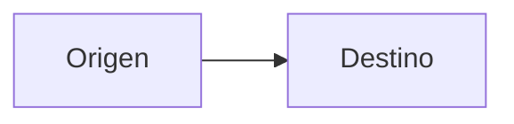

# AmoxDiagram

**🌐 [English](../../en/editor/amoxdiagram.md) · Español**

> Dibuja arquitecturas y procesos arrastrando cajas. Lo que se guarda es texto mermaid: un archivo `.amoxdiagram`, o el diagrama que ya vive dentro de uno de tus documentos.

<!-- 📷 CAPTURE: docs/images/editor/amoxdiagram.png — AmoxDiagram con un diagrama de arquitectura: paleta de formas y esquema a la izquierda, lienzo con dos zonas agrupadas y cajas coloreadas por capa en el centro, inspector a la derecha y el panel de mermaid abierto abajo. -->

## Qué es

**AmoxDiagram** es el editor visual de diagramas. Se dibuja con el ratón y **lo que se
guarda es mermaid**, el mismo texto que ya entendían tus documentos: un bloque

````

````

Eso tiene dos consecuencias que se notan enseguida. La primera es que **el diagrama se lee
sin la aplicación**: en el navegador de un repositorio, en cualquier editor de texto, en
cualquier sitio donde se mire markdown. La segunda es que **el control de versiones lo
entiende**: un diff dice «se añadió una caja», no «el archivo binario cambió».

Un diagrama puede vivir de dos maneras:

- Como **archivo propio**, `.amoxdiagram`. Es un diagrama que existe por sí mismo.
- Como **bloque dentro de un documento**. Es un diagrama que explica algo, con su texto
  alrededor.

## Cuándo usarlo

- Para dibujar la **arquitectura** de una plataforma de datos: orígenes, zonas de
  aterrizaje, capas de transformación, almacenes, consumos.
- Para documentar un **proceso esperado** antes de construirlo — un flujo de experimento,
  un ciclo de reentrenamiento.
- Para explicar **de dónde sale un dato** a alguien que no va a leer el SQL.

## Cómo usarlo

### Empezar

Un diagrama nuevo sale del `+` de la barra de pestañas, del explorador de archivos, de la
paleta de comandos, o de la pantalla de un proyecto recién abierto. Cualquiera de los
cuatro crea un `.amoxdiagram` con tres cajas de ejemplo.

Si el diagrama ya existe dentro de un documento, pasa el ratón por encima del dibujo en la
vista **Leer** y pulsa **Editar**. Se abre en su propia pestaña.

### Dibujar

Hay tres formas de añadir una caja, y sirven para tres momentos distintos:

| Gesto | Cuándo |
|---|---|
| Pulsar una forma de la paleta | Ya sabes qué forma quieres |
| Doble clic en el lienzo vacío | La primera vez |
| <kbd>Tab</kbd> con una caja seleccionada | Tienes el diagrama en la cabeza y lo estás volcando |

Con una caja seleccionada, las tres **encadenan** la nueva a ella. Para escribir el texto,
doble clic encima. Para conectar dos cajas, arrastra desde el borde de una a la otra.

### Las catorce formas

Cada una significa algo, y el inspector las llama por su significado, no por su sintaxis:

| Forma | Qué suele ser |
|---|---|
| Proceso | Un paso: una transformación, un trabajo |
| Paso suave | Un paso menor |
| Almacén | Una base de datos, un archivo, un bucket |
| Decisión | Una bifurcación: ¿pasa calidad? |
| Entrada | Algo que llega de fuera |
| Salida | Algo que sale: un informe, un fichero |
| Hito | Un punto de referencia: el tablero, el entregable |
| Principio o final | Donde empieza o acaba el flujo |
| Subproceso | Un proceso documentado aparte |
| Preparación | Lo que hay que dejar listo antes |
| Operación manual | Un paso que hace una persona |
| Entrada manual | Un dato que alguien teclea |
| Nota | Una marca al margen del flujo |
| Fin definitivo | Aquí se acaba, sin vuelta |

### La paleta aprende

Catorce son las clásicas del diagrama de flujo, pero mermaid dibuja bastantes más con
nombre propio — cilindros, documentos, relojes de arena. No están todas en la paleta a
propósito: cuarenta y seis siluetas de 19 px que hay que recorrer para encontrar «almacén»
sirven peor que catorce.

Así que la base es corta y **cada uno se queda con las que usa**. Si escribes a mano en el
panel de texto una caja con nombre de forma:

```
informe@{ shape: doc, label: "Informe mensual" }
```

el editor la reconoce y te ofrece añadirla a tu paleta. Le pregunta a mermaid cómo la
dibuja y se guarda su contorno, así que la silueta que ves es la misma línea que va a salir
en el documento.

Las aprendidas aparecen al final de la paleta, con su propio filete para distinguirlas de
las catorce. Se usan igual que las demás; para quitar una, púlsala con <kbd>Mayús</kbd>.
Viajan contigo de un proyecto a otro y no se escriben en el repositorio: son tuyas, no del
diagrama.

Si el nombre está mal escrito y mermaid no sabe dibujar nada con él, no se añade — así la
paleta no se llena de botones que no producen nada.

### Las flechas dicen cómo corre

Tres estilos, nombrados por lo que significan y no por su sintaxis:

- **Por lotes** — la línea normal. Lo que se ejecuta cada día, cada hora.
- **Continuo** — la línea punteada. Evento a evento.
- **Camino principal** — la línea gruesa. Lo que quieres que se mire primero.

### Zonas y capas

Son las dos cosas que convierten un montón de cajas en una arquitectura.

Una **zona** agrupa cajas en un recuadro: aterrizaje, refinado, consumo. Selecciona varias
cajas con <kbd>Ctrl</kbd> y pulsa **Agrupar**. Deshacer el grupo quita el recuadro; las
cajas se quedan donde estaban.

Una **capa** es un color: qué cajas son orígenes, cuáles proceso, cuáles salida. Se asigna
desde el inspector. Una caja lleva una capa, no varias — dos colores se pisan y el
resultado depende del orden de las líneas del archivo.

### Guardar

Si el diagrama es un `.amoxdiagram`, guarda en su archivo. Si vino de un documento, **el
botón lo dice**: *Guardar en arquitectura.md*. Se reescribe sólo ese bloque; el resto del
documento no se toca.

Si alguien cambió el documento mientras lo editabas, se avisa antes de escribir y hay tres
salidas: cancelar, guardar el diagrama aparte como archivo propio, o sobrescribir.

### Llevárselo

**SVG** para un documento que se va a imprimir o ampliar; **PNG** para pegarlo en una
presentación. Los dos se piden a mermaid, así que la imagen es **la misma que dibuja el
documento**, no una foto del editor.

## Lo que no hace, y por qué

**No se colocan las cajas a mano.** Mermaid no guarda coordenadas: si se pudieran fijar,
colocarías una caja, guardarías, y al reabrir estaría en otro sitio. A cambio el dibujo
nunca queda torcido, y lo que ves en el editor es exactamente lo que va a salir en el
documento.

**No hay iconos de productos.** Escribe en la etiqueta lo que quieras; el nombre de un
sistema es contenido tuyo.

**No se abre cualquier diagrama.** Sólo los de flujo (`flowchart`). Un diagrama de
secuencia o de estados sigue funcionando en tus documentos, simplemente no ofrece el botón
de editar — no es un fallo, es otro tipo de diagrama. Y si un flujo usa algo que el editor
todavía no sabe dibujar, te dice **qué línea**.

**Lo que no entiende, no lo toca.** Los `classDef`, `style`, `click`, las directivas
`%%{init}%%` y tus comentarios sobreviven palabra por palabra a cualquier edición.

## Relacionado

- [Editor de documentos](../reference/keyboard-shortcuts.md) — los diagramas viven dentro de tus `.md`
- [Data Flow](../data-flow/data-flow.md) — genera el esqueleto de un diagrama desde una chain
