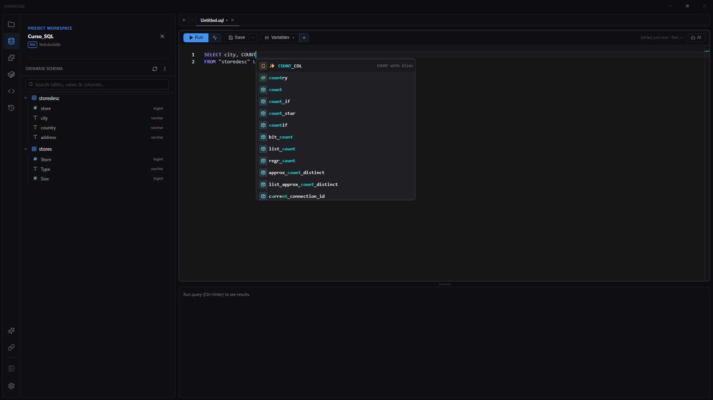

# Editor SQL

**🌐 [English](../../en/editor/sql-editor.md) · Español**

> El editor de código de AmoxSQL: escribe, ejecuta y depura SQL de DuckDB con autocompletado que entiende tu esquema, resaltado de sintaxis y ejecución en un atajo.

## Qué es

El editor SQL es el corazón del IDE. Está construido sobre un editor de código profesional con resaltado de sintaxis específico para DuckDB, y se conecta en vivo con el motor local para darte autocompletado y validación reales — no adivinanzas.

Cada archivo `.sql` que abres se edita aquí, dentro de una **pestaña** en un panel. Puedes tener varias pestañas y dividir la vista en dos paneles (ver [Layout, pestañas y paneles](layout-tabs-and-panes.md)). Debajo del editor aparece el panel de **resultados** cuando ejecutas una query (ver [Tabla de resultados](../results/results-table.md)).

El resaltado reconoce toda la sintaxis de DuckDB — incluyendo `PIVOT`/`UNPIVOT`, `QUALIFY`, los modificadores de `JOIN` — y también los bloques de plantillas Jinja/dbt (`{{ }}`, ``, `{# #}`) cuando editas modelos dbt.

## Cuándo usarlo

- Para escribir y ejecutar cualquier consulta SQL sobre tu base de datos o sobre archivos de datos.
- Cuando quieras una sola query enfocada. Para un análisis narrado con varias celdas y texto, usa un [Notebook](../notebooks/notebooks.md); para encadenar pasos de transformación visualmente, usa [Data Flow](../data-flow/data-flow.md).

## Cómo usarlo

### Ejecutar una query
1. Escribe tu SQL en el editor.
2. Presiona **Ctrl+Enter** (o el botón **Run** de la barra de acciones). Si tienes texto **seleccionado**, se ejecuta solo la selección; si no, se ejecuta todo el buffer.
3. Los resultados aparecen en el panel inferior. Un botón **Stop** cancela una query en curso.

> Si tu archivo contiene varias sentencias separadas por `;`, AmoxSQL te ofrecerá convertirlo en un Notebook (una celda por sentencia) en lugar de ejecutarlas a ciegas.

### Barra de acciones del editor
| Acción | Qué hace |
|---|---|
| **Run / Stop** | Ejecuta la query (selección o todo) · cancela la ejecución en curso |
| **Analyze** | Abre el [plan de ejecución](../results/execution-plan.md) (EXPLAIN / ANALYZE) |
| **Save** ▾ | Guarda el archivo · **Save As…** para guardar con otro nombre |
| **Export** ▾ | **Export data to file…** (re-ejecuta la query completa a CSV/Parquet/Excel/nube) · **Metadata for AI…** (ver [Metadata para IA](../ai/metadata-for-ai.md)) |
| **History** | Abre el [historial de consultas](history-and-bookmarks.md) |
| **Variables** | Muestra/oculta el panel de [variables](variables.md) `${...}` |
| **Assist** | Abre el [Asistente de IA](../ai/editor-assistant.md) del panel |

La barra también muestra "Editado hace Xs · Ejecutado hace Xs" para orientarte.

> **El export pertenece a la query.** El botón **Export** del editor exporta el resultado completo de la **query actual del editor** (re-ejecutándola), mientras que el botón **Download** del panel de resultados descarga solo las filas ya cargadas en la tabla. Ver [Guardar resultados](../results/saving-results.md).

### Autocompletado
Mientras escribes, el editor sugiere tablas, columnas y funciones de DuckDB según el contexto de la cláusula (por ejemplo, no ofrece agregados en un `WHERE`). Resuelve incluso las columnas de salida de CTEs y subconsultas consultando al propio motor. Es un tema por sí mismo: ver [Autocompletado](autocomplete.md).

### Depurar CTEs
Cada definición `nombre AS (` muestra un glifo ▶ en el margen: haz clic para ejecutar la query truncada hasta esa CTE y ver su resultado intermedio. Ver [Depurar CTEs](cte-debugging.md).

### Formatear SQL
Presiona **Ctrl+K** (o **Shift+Alt+F**) para formatear la selección o todo el documento. El estilo (ancho de tabulación, mayúsculas de keywords, líneas entre queries) se configura en Ajustes → Editor.

### Buscar y reemplazar
**Ctrl+F** abre buscar; **Ctrl+H** abre buscar y reemplazar dentro del editor.

### Errores en línea
Cuando una query falla, AmoxSQL resalta la línea/columna del error directamente en el editor y te lleva a ella. El marcador se limpia al editar.

## Referencia de opciones del editor

Configurables en **Ajustes → Editor** (ver [Configuración](../reference/configuration.md)):

| Opción | Qué controla |
|---|---|
| Familia y tamaño de fuente | Tipografía del código (6 familias incluidas) |
| Minimapa | Mapa de navegación a la derecha |
| Word wrap | Ajuste de línea |
| Números de línea | Mostrar/ocultar |
| Tamaño de tabulación | Ancho de indentación |
| Zoom con rueda del mouse | Ctrl + rueda para acercar/alejar |
| Colorización de pares de brackets | Colorear paréntesis emparejados |
| Guías de indentación | Líneas verticales de indentación |
| Estilo/parpadeo del cursor | Apariencia del cursor |

El estado de vista (cursor y scroll) se recuerda por pestaña, así que cambiar de pestaña y volver te deja donde estabas.

## Tips y gemas

- **Ejecuta solo una parte:** selecciona un fragmento y **Ctrl+Enter** ejecuta únicamente esa selección.
- **Columnas derivadas en el autocompletado:** el editor resuelve columnas como `SELECT a + b AS total` de una CTE preguntándole a DuckDB por su esquema real — algo que un analizador puramente sintáctico no puede hacer.
- **Hover de funciones:** pasa el mouse sobre una función de DuckDB para ver su firma, categoría y descripción.
- **El tema sigue tu configuración:** el editor adopta el tema y el color de acento activos en vivo (ver [Temas y apariencia](../user-guide/themes-and-appearance.md)).

## Atajos de teclado

| Atajo | Acción |
|---|---|
| Ctrl+Enter · F5 | Ejecutar (selección o todo) |
| Ctrl+S · Ctrl+Shift+S | Guardar · Guardar como |
| Ctrl+Shift+A | Analizar plan |
| Ctrl+K · Shift+Alt+F | Formatear SQL |
| Ctrl+F · Ctrl+H | Buscar · Buscar y reemplazar |
| Ctrl+Shift+H | Historial de consultas |
| Ctrl+/ · Ctrl+D · Ctrl+Shift+K | Comentar · duplicar línea · borrar línea |

Set completo en [Atajos de teclado](../reference/keyboard-shortcuts.md).

## Relacionado

- [Autocompletado](autocomplete.md) · [Depurar CTEs](cte-debugging.md) · [Variables](variables.md)
- [Tabla de resultados](../results/results-table.md) · [Plan de ejecución](../results/execution-plan.md)
- [Notebooks](../notebooks/notebooks.md) · [Layout, pestañas y paneles](layout-tabs-and-panes.md)
